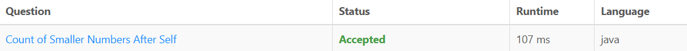
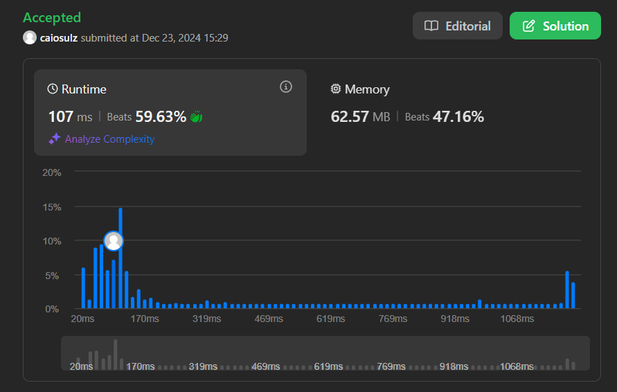

# 315. Count of Smaller Numbers After Self

### Link Questão: [315. Count of Smaller Numbers After Self](https://leetcode.com/problems/count-of-smaller-numbers-after-self/description/)

#### Nível: Difícil

#### Linguagem utilizada: Java

---

## Resultado Juiz Eletrônico (LeetCode)

<center>





</center>

## Resumo

- O problema consiste em encontrar a quantidade de números menores que ele mesmo do lado direito.

- Dado um array inteiro `nums`, retorne um array inteiro `counts` onde `counts[i]` é o número de elementos menores à direita de `nums[i]`.

- A resolução utiliza o algoritmo de contagem de inversões, uma modificação do Merge Sort que, além de ordenar o vetor, calcula quantos elementos menores existem à direita de cada posição no vetor original. Para isso, o algoritmo armazena a posição original de cada elemento e atualiza a contagem de elementos menores durante o processo de mesclagem. Assim, cada elemento mantém sua posição e quantidade de inversões mesmo após o vetor ser ordenado, permitindo obter o resultado desejado de forma eficiente.

## Solução

### Arquivo: [315. Count of Smaller Numbers After Self](./315.Count_of_Smaller_Numbers_After_Self.java)

### Código em Java:

```java

import java.util.ArrayList;
import java.util.List;

public class Solution {
    public List<Integer> countSmaller(int[] nums) {
        if (nums == null || nums.length == 0) return new ArrayList<>();
        
        int tamanho = nums.length;
        int[] resultado = new int[tamanho]; // Armazena a contagem de menores à direita
        
        // Criar um array de objetos para armazenar valores e índices originais
        ValorComIndiceOriginal[] valoresComIndices = new ValorComIndiceOriginal[tamanho];
        for (int i = 0; i < tamanho; i++) {
            valoresComIndices[i] = new ValorComIndiceOriginal(nums[i], i);
        }
        
        // Chamar o método de merge sort modificado
        ordenarEContar(valoresComIndices, 0, tamanho - 1, resultado);
        
        // Converter o array de resultados para uma lista
        List<Integer> listaResultados = new ArrayList<>();
        for (int contagem : resultado) {
            listaResultados.add(contagem);
        }
        
        return listaResultados;
    }

    private void ordenarEContar(ValorComIndiceOriginal[] numeros, int inicio, int fim, int[] resultado) {
        if (inicio >= fim) return;
        
        int meio = (inicio + fim) / 2;
        
        // Dividir o array recursivamente
        ordenarEContar(numeros, inicio, meio, resultado);
        ordenarEContar(numeros, meio + 1, fim, resultado);
        
        // Mesclar as duas metades ordenadas e contar os menores à direita
        mesclarEContar(numeros, inicio, meio, fim, resultado);
    }

    private void mesclarEContar(ValorComIndiceOriginal[] numeros, int inicio, int meio, int fim, int[] resultado) {
        int posicaoEsquerda = inicio;
        int posicaoDireita = meio + 1;
        List<ValorComIndiceOriginal> mesclado = new ArrayList<>();
        int menoresNoLadoDireito = 0;
        
        // Mesclar os dois subarrays enquanto conta menores à direita
        while (posicaoEsquerda <= meio && posicaoDireita <= fim) {
            if (numeros[posicaoEsquerda].valor > numeros[posicaoDireita].valor) {
                menoresNoLadoDireito++;
                mesclado.add(numeros[posicaoDireita]);
                posicaoDireita++;
            } else {
                resultado[numeros[posicaoEsquerda].indiceOriginal] += menoresNoLadoDireito;
                mesclado.add(numeros[posicaoEsquerda]);
                posicaoEsquerda++;
            }
        }
        
        // Adicionar os elementos restantes do lado esquerdo
        while (posicaoEsquerda <= meio) {
            resultado[numeros[posicaoEsquerda].indiceOriginal] += menoresNoLadoDireito;
            mesclado.add(numeros[posicaoEsquerda]);
            posicaoEsquerda++;
        }
        
        // Adicionar os elementos restantes do lado direito
        while (posicaoDireita <= fim) {
            mesclado.add(numeros[posicaoDireita]);
            posicaoDireita++;
        }
        
        // Copiar de volta para o array original
        for (int i = inicio; i <= fim; i++) {
            numeros[i] = mesclado.get(i - inicio);
        }
    }
}

// Classe auxiliar valor e índice original de cada elemento
class ValorComIndiceOriginal {
    int valor;
    int indiceOriginal;
    
    public ValorComIndiceOriginal(int valor, int indiceOriginal) {
        this.valor = valor;
        this.indiceOriginal = indiceOriginal;
    }
}

```
