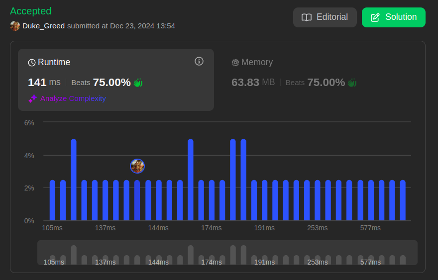

# D&C Questões LeetCode

**Número da Lista**: 33 
**Conteúdo da Disciplina**: D&C 

## Alunos
| Matrícula | Aluno                       |
|-----------|-----------------------------|
| 202046087 | Fabrício Macedo de Queiroz  |
| 202046004 | Caio Moreira Sulz Gonsalves |

## Sobre

Tendo em vista a aplicação do conteúdo D&C, ou melhor, Dividir e Conquistar (que envolve a aprendizagem dos seguintes algoritmos: Contagem de Inversões, Mediana das Medianas, Par de Pontos Mais Próximos e Kruskal) na prática, foram resolvidas apenas 2 questões do site [LeetCode](https://leetcode.com/). Sendo elas, duas questões de nível Difícil (**_Hard_**).

## Linguagens

<table style="border: none; text-align: center;">
    <tr>
        <td>
            <strong>C#</strong>
        </td>
        <td>
            <strong>Java</strong>
        </td>
    </tr>
    <tr>
        <td>
            
        </td>
        <td>
            
        </td>
</table>

## Questões

| Nível   | Link para a questão                                                            | Linguagem |
|---------|--------------------------------------------------------------------------------|-----------|
| Difícil | [493. Reverse Pairs](https://leetcode.com/problems/reverse-pairs/description/) | C#        |
| Difícil |   | Java      |

## Uso / Manual de como Rodar

### Direto no LeetCode

1. É necessário ter uma conta no **LeetCode** e acessar uma das questões na tabela acima.

2. Copiar a resposta da referida questão no repositório.

3. Logo abaixo do título da aba **_"Code"_**, selecione a linguagem com a qual a solução disponível no repositório foi escrita.

4. Apague a definição de Classe que já vem escrita na IDE da aba **_"Code"_** e cole a solução copiada anteriormente.

5. Clique em **_"Run"_** na parte inferior da aba **_"Code"_**, para rodar os casos de teste e verificar se a solução está correta.

6. Caso deseje ter mais certeza acerca da solução, clique em **_"Submit"_**, com isso uma grande quantidade de outros casos de teste serão verificados e retornará o resultado final informando se a resposta está correta ou não. O lado negativo dessa opção é que o **LeetCode** salvará essa submissão na conta utilizada ao clicar em **_"Submit"_**.

### Alternativamente

- É possível rodar as soluções facilmente em sites como o [myCompiler](https://www.mycompiler.io/pt/new/csharp), para a linguagem C#, e o [JDoodle](https://www.jdoodle.com/online-java-compiler) para a linguagem Java.

- Vale ressaltar que sendo questões para o LeetCode, as soluções não possuem entrada de dados, sendo necessário modificar a solução para que a entrada de dados seja feita de forma manual. Ou seja, também não possuem o método `main()`. Tornando mais viável executá-las diretamente no LeetCode.

## Screenshots

Os Links nos títulos levam ao `.md` com detalhes acerca da solução de cada questão.

### [493. Reverse Pairs](./Questions/Hard_1/Hard_1.md)

### 

## Vídeos Explicando as Questões

- ### Questão Difícil 1: [493. Reverse Pairs](https://youtu.be/7Rlj3mMY_vo)

- ### Questão Difícil 2: 